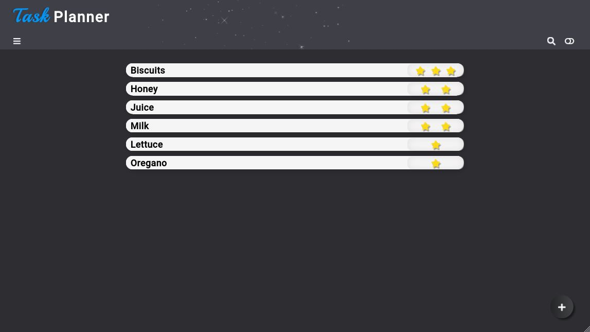

# Task Tracker



A React-based, fully responsive task tracker. It saves any data provided in localStorage, along with the selected theme, and arranges the tasks in a descending order based on priority.

## Installation

As this project was bootstrapped with React, the following scripts are available:

**Install** the dependencies:

```
npm install
```

Run the app in **development** mode:

```
npm start
```

Launch the **test server** in the interactive watch mode:

```
npm test
```

## Features

- Two themes
- Search bar for existing tasks
- Saves preferences & data to localStorage

## Tech

- React
- CSS Modules
- Lodash
- FontAwesome

For a more detailed overview of the development & production dependencies, please check `package.json`.

## Live Version

<https://developedbygeo.github.io/Task-tracker/>

## Contributing

Contributions are certainly welcome. Please feel free to open an issue/PR if there is something you would like to be changed.

## Acknowledgements

A massive thank you to The Odin Project & freeCodeCamp for their guidance and quality material.

## License

[MIT](./LICENSE.md)
